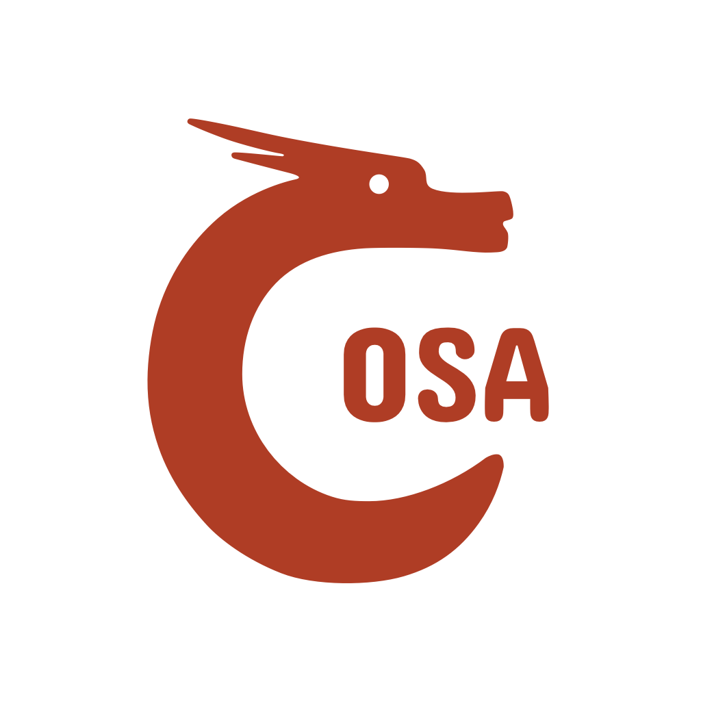

  

# 开源软件协会组建计划

## 什么是 LUG

LUG 全称 Linux User Group，即 Linux 用户组，或者叫 Linux 用户协会，在很多高校 LUG 通常和也别称为开源软件协会或开源社区。

LUG 起源于硅谷，中国第一个 LUG 是上海 LUG，目前国内城市级的 LUG 有北京上海成都重庆杭州深圳等，高校级的 LUG 比较有名的有中科大 LUG、清华 TUNA 等，还有很多不那么知名的高校也有 LUG（从相关城市的 LUG 官网可以找到），有部分高校的 LUG 没有官网所以在搜索引擎上找不到。

LUG 一般由相应城市或高校的 GNU/Linux 爱好者发起，目的是互相之间进行开源技术分享交流，以及向广大普通用户宣传自由软件和开源精神。

## 为什么我校需要一个 LUG

首先，一个实际问题是，我们学校计算机方面的实力比较弱，从我进校（2015 年）开始，就没有一个像样的有技术实力的计算机相关社团出现。虽然也有大佬，但大佬们主要是自己玩。

然后经过以前的几次尝试，和跟其他学校的类似社团负责人的交流，和跟目前「组建」群里的大家的交流，我觉得我之前应该是走的方向不太对，其实不应该一下子就想着去招大佬，实际上大佬即使有也一定是很少的，更不用说大一，但有很多人是愿意甚至有兴趣去学习的，更正确的方式应该是给这部分人一些经验的提示和引导，让他们最终成为大佬。虽然这很困难，但是不能急。

然后，其实我之前几次搞的时候一直没想清楚到底应该给这样一个社团什么名字，无论是开发者协会、野生技术区，都感觉不太对，后来经过一些交流突然明白其实想搞的就是一种 LUG 这样的东西，它传达的应该是一种思想、一种精神、一种学习和实践的方式。

现代计算机行业，开源精神已经非常重要了，从我的理解来看，它很重要的一点是鼓励大家参与和分享，无论是使用还是开发，当我们使用开源软件、或者自由软件的时候，通过 GitHub 等工具，我们是可以深度参与到这个软件的创造过程的。当我们参与到这种过程时，即使我们自己并没有真正开发软件，我们也能从中学习到那种严谨认真的态度。举个例子，只是单纯从课堂上是绝对不会学习到代码风格的最佳实践的，但是代码风格实际上是真实软件开发中极其重要的一个事情，这种知识很容易通过参与开源项目来学会。

鼓励大家在开源软件的氛围里学习我认为能够让大家所学的知识更和实际产业接轨，对软件开发的理解也会更加准确和深入。而且，开源社区不会歧视初学者，在参与中慢慢得到技能提升、写出来程序能够开源并被他人使用，这样带来成就感是非常高的，远比自己闷头看课本写出来的那点 hello world 有效。

而从我的感觉上来说，我校的同学是缺少上述的这种思想和学习方式的。

## 我们学校的特色／问题

- 优质课程比较少，表现在两个方面：
  - 老师有兴趣讲，也很努力地在讲，甚至对作业要求也比较高，但老师自己由于常年没有接触业界，导致知识比较陈旧，甚至可能出错
  - 老师自己都没兴趣讲，上课就是无精打采地读 PPT
- 用的课本并不是业界经典作品，导致内容质量比较差，错误百出，也不容易理解
- 没有计算机的研究氛围，没有像样的计算机社团
- 有很多同学是有兴趣的，但因为上大学之后才开始学习编程，而接触到的环境又是上面所说的这种环境，导致可能十分努力也感觉不到编程的乐趣，以及接触不到真实的业界

## 我们现在有什么

### 人
- 电脑 120、计算机协会的成员应该有一些有兴趣加入，后期搞活动的话，即使他们没有加入也不妨一起宣传，有兴趣的都可以来。
- ACM 队的人几乎全都用 Linux
- 有没有可能邀请到老师？ # 目前没有合适人选

### 物资

- 文约楼 309 有一个隶属于 ACM 队的高配服务器，目前安装了 ESXi，可以分配计算资源，开网站等服务
- cczu.org 域名

### 活动资源

- 以电脑 120 或计算机协会的名义可以借到教室，以及张贴海报
- 因为认识部分信数院的小班，某些合适的活动也可以在相应的班做一些宣传

## 活动

### 其他高校 LUG 和类似社团的活动

首先参考下别的学校办了哪些活动：

- Linux Install Party（基本都有）
- 每周小聚（USTC LUG）
- 金枪鱼之夜（清华 TUNA，应该类似于 USTC LUG 的每周小聚）
- Hackthon（清华 TUNA）
- Hackergame（USTC LUG）
- 自由软件日（USTC LUG、TUNA 都有，是个国际同步的）
- 培训（基本都有）
- ...

### 我们可以办什么／怎么办活动

- Linux Install Party
- 每周小聚
- 线上答疑

**Linux Install Party** 就是手把手带着参与者安装 Linux，并进行最基本的使用。这个用 VirtualBox 装个虚拟机就可以了，直接让大家跟着操作，比较简单。这个活动可以每学期一到两次？

**每周小聚** 进行类似于小讲座形式的技术分享，但不那么正式，实际可能每两周进行一次。内容可以参考 USTC LUG 和清华 TUNA 的往期题目。因为这个需要两周一次地选定分享人，并且准备内容、PPT 等，所以比较复杂。

> 上面两个活动都需要能借到有多媒体的教室，并且可以在 Bilibili Live 开直播间，通过分享转发可能一定程度上提高知名度。
>
> 线下活动的参与度问题，可通过发福利来解决，来的次数比较多的，可以赠送校内 VPS、网盘空间，以及，参加活动的人，可以得到活动内容相关的电子书。

**线上答疑** 定期组织线上的语音交流，回答同学们在 Linux 使用、编程等方面的问题。

## 项目／产品

### 别人有什么

- 开源软件镜像
- DNS
- Git
- VPN
- 博客（技术分享、活动总结）
- FTP（资源汇总）
- 教务辅助
- 跳蚤市场
- 匿名留言板／树洞
- Wiki（文档）
- 网盘
- 云计算
- OJ

### 我们已经有什么

- Git
- VPN（实际上是 Shadowsocks）
- 网盘
- OJ

目前已经有的这些都在 309 的机子上跑着。

### 我们还可以有什么

目前 309 的机子并不是直接能够获得稳定的公网 IP 的，这是一方面，另外就是网速限制 10 Mbps。

- 博客：可以给成员们分配账号，然后可以发文章，其中可以包括，技术分享、教程、生存指南、生活感悟等
- 资源共享：用于提供常用的电子书、视频，和活动的 PPT、相关资源等，用 h5ai 搭建很简单（类似于 https://ftp.ustclug.org/）

## 具体操作

### 社团名字

中文：开源软件协会
英文：Open Source Association
简称：OSA

### 活动举办

早期应该不需要注册社团，具体活动依附于电脑 120、计算机协会、ACM 队等来进行，合作搞活动，多重冠名。参加的人也不限于 LUG 成员，而是在上述组织中都可以参加。

### 可能的问题和解决办法

- 群里没人说话：一开始一个群的时候，可以允许水群，适当引入机器人提高活跃度，如果后期水群导致大佬普遍 mute，那么建一个新的闲聊群来接受水群
- 群里的问题过于小白：适当不理，或回复《提问的智慧》，确实提得比较多的小白问题，可以放到活动中来解答，或写到博客里
- 活动参加人数比较少：实际上包括核心成员在内，能够有 10 人左右，每周小聚这种活动就应该能办得起来了，人数并不是非常重要。另外，通过在电脑 120、计算机协会群广泛宣传，可以让人数稍微多一些。以及，还有直播，可以有一些人在线参加

## 近期的未来

这学期剩余的时间里如果能成功办四次活动，就算非常成功了。其中可能包括三次小聚，一次 Install Party。

## 遥远的未来

- 获得学校或信数院官方支持
- 成为一个注册社团
- 拥有更好的网络条件和服务器资源
